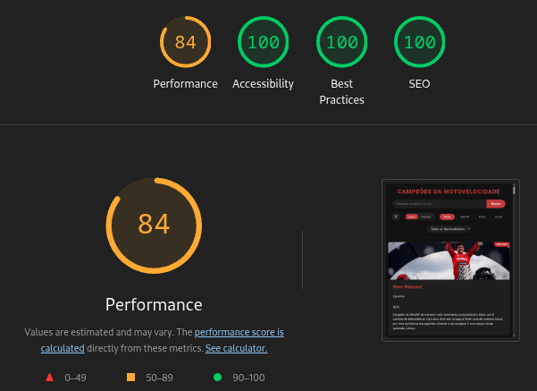

# Motovelocidade - Campeões Mundiais (2015-2025)

## Objetivo

O principal objetivo é apresentar ao máximo de pessoas o mundo da motovelocidade onde as disputas são intensas e emocionantes, compartilhando um pouco da minha paixão pelo esporte.
Para isso construi uma base de dados dos campeões mundias da MotoGP, Moto2 e Moto3 desde 2015 até 2025, falando um pouco sobre essas grandes referências do esporte para que as pessoas possam conhecer um pouco de cada um dos pilotos.

Mim esforcei para deixar o site acessível para todas as pessoas tomando o cuidado de colocar cores de alto contraste, de descrever cada imagem da tela e também de facilitar a navegação usando o teclado.

## Funcionalidades

- **Navegação Intuitiva:** Interface amigável e fácil de usar, permitindo que os usuários encontrem rapidamente as informações desejadas.
- **Busca Inteligente:** Encontre pilotos ou anos específicos usando a barra de pesquisa.
- **Filtros:**
  - **Categoria:** Filtre os campeões por categoria (MotoGP, Moto2, Moto3).
  - **Nacionalidade:** Filtre os campeões por nacionalidade.
- **Layouts:**
  - **Cards:** Visualize os cards dos campeões em um layout de grade responsivo.
  - **Detalhes:** Explore informações detalhadas de cada campeão em um layout dedicado, com estatísticas e descrições completas.
- **Navegação Detalhada:** Navegue entre os campeões no modo de detalhes usando o scroll do mouse.

## Versão online

Acesse o projeto usando o seguinte link:
https://maycon40.github.io/knowledge-base-motogp/

## Acessibilidade e Performance

O projeto foi desenvolvido com um forte compromisso com a acessibilidade e a performance, garantindo que o conteúdo seja acessível e rápido para o maior número de pessoas possível.

- **HTML Semântico:** A estrutura do site utiliza tags HTML semânticas (`<main>`, `<header>`, `<footer>`, `<section>`, `<figure>`, `<figcaption>`) para fornecer um contexto claro e uma estrutura lógica do conteúdo, facilitando a navegação por leitores de tela.

- **Textos Alternativos Descritivos:** Todas as imagens dos campeões possuem um atributo `alt` detalhado. Essa descrição ajuda usuários com deficiência visual a compreenderem o conteúdo visual da imagem através de leitores de tela.

- **Temas de Alto Contraste:**

  - **Tema Claro Acessível:** O tema claro foi projetado com uma paleta de cores de alto contraste (azul forte sobre fundo claro), beneficiando usuários com baixa visão ou diferentes formas de daltonismo.
  - **Escolha do Usuário:** A opção de alternar entre os temas claro e escuro permite que os usuários escolham o modo de visualização mais confortável para suas necessidades, com a preferência salva no navegador.

- **Navegação via Teclado:** A aplicação é totalmente navegável utilizando apenas o teclado. Elementos interativos como botões, links e campos de formulário possuem estados de foco (`:focus`) claros e visíveis.

- **Labels e Atributos ARIA:** Controles de formulário possuem `label`s associadas e botões que utilizam apenas ícones possuem o atributo `aria-label` para fornecer uma descrição textual de sua ação.

<br/>

### Ferramentas usadas para testar a acessibilidade e performance

A seguinte imagem mostra o resultado no Lighthouse, mostrando que a página tem boa acessibilidade, performance, melhores práticas e um bom seo.

<p align="center">
  
</p>
<br/>

Usei a Coblis (Color Blindness Simulator) para ver se o site estava fácil de ser enxergado por pessoas com deficiência visual.

https://www.color-blindness.com/coblis-color-blindness-simulator/

## Tecnologias Utilizadas

- **HTML:** Estrutura da página e conteúdo.
- **CSS:** Estilos visuais e layout responsivo.
- **JavaScript:**
  - Lógica da aplicação, manipulação do DOM e interatividade.
  - Filtros, busca, troca de layouts e navegação detalhada.
  - Integração com a API do Gemini para o chatbot.
- **Google Fonts:** Ícones e fontes personalizadas para uma melhor experiência visual.

## Como Rodar a Aplicação Localmente

Siga estas etapas para executar a aplicação no seu ambiente local:

1.  **Clone o repositório:**

    ```bash
    git clone https://github.com/Maycon40/knowledge-base-motogp.git
    cd knowledge-base-motogp
    ```

2.  **Abra o arquivo `index.html` no seu navegador:**

    - A aplicação deverá ser executada diretamente no navegador, sem necessidade de um servidor web local.
