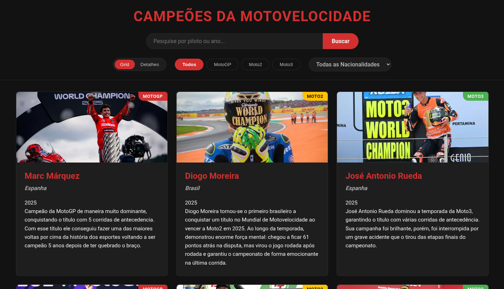

# Base de Conhecimento MotoGP - Campeões Mundiais (2015-2025)



## Visão Geral

Esta é uma base de conhecimento interativa que fornece informações detalhadas sobre todos os campeões mundiais de MotoGP, Moto2 e Moto3 dos últimos 10 anos (2015-2025). O projeto foi desenvolvido para ser uma fonte de consulta rápida e completa para fãs de motovelocidade, jornalistas e pesquisadores.

## Funcionalidades

- **Navegação Intuitiva:** Interface amigável e fácil de usar, permitindo que os usuários encontrem rapidamente as informações desejadas.
- **Busca Inteligente:** Encontre pilotos ou anos específicos usando a barra de pesquisa.
- **Filtros:**
  - **Categoria:** Filtre os campeões por categoria (MotoGP, Moto2, Moto3).
  - **Nacionalidade:** Filtre os campeões por nacionalidade.
- **Layouts:**
  - **Cards:** Visualize os cards dos campeões em um layout de grade responsivo.
  - **Detalhes:** Explore informações detalhadas de cada campeão em um layout dedicado, com estatísticas e descrições completas.
- **Navegação Detalhada:** Navegue entre os campeões no modo de detalhes usando os botões de navegação ou o scroll do mouse.

## Acessibilidade

Em cada imagem do site foi incluído atributos alt descritivo que ajuda as pessoas com deficiência visual a entender o que está sendo mostrado.
Coloquei as cores de maneira que pessoas com daltonismo consiguam enchergar a página.
Incluí light mode e dark mode para a pessoas conseguir vê a página em um ambiente mais agradável.

## Tecnologias Utilizadas

- **HTML:** Estrutura da página e conteúdo.
- **CSS:** Estilos visuais, layout responsivo e animações.
- **JavaScript:**
  - Lógica da aplicação, manipulação do DOM e interatividade.
  - Filtros, busca, troca de layouts e navegação detalhada.
  - Integração com a API do Gemini para o chatbot.
- **Google Fonts:** Ícones e fontes personalizadas para uma melhor experiência visual.

## Como Rodar a Aplicação Localmente

Siga estas etapas para executar a aplicação no seu ambiente local:

1.  **Clone o repositório:**

    ```bash
    git clone https://github.com/Maycon40/knowledge-base-motogp.git
    cd knowledge-base-motogp
    ```

2.  **Abra o arquivo `index.html` no seu navegador:**

    - A aplicação deverá ser executada diretamente no navegador, sem necessidade de um servidor web local.
